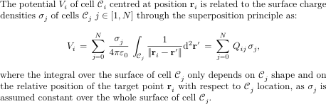
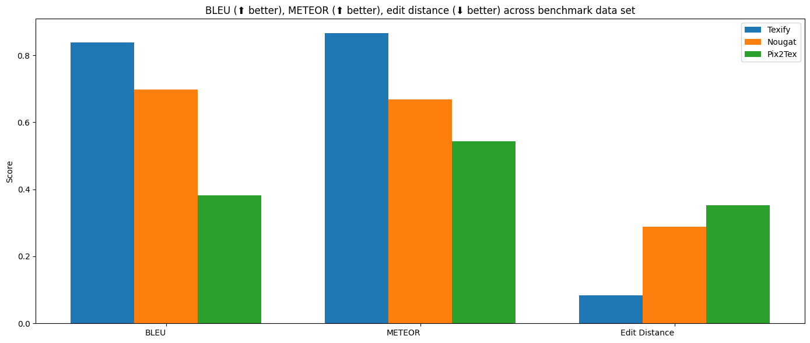

# Texify

Texify is an OCR model that converts images or pdfs containing math into markdown and LaTeX that can be rendered by MathJax ($$ and $ are delimiters).  It can run on CPU, GPU, or MPS.

https://github.com/VikParuchuri/texify/assets/913340/882022a6-020d-4796-af02-67cb77bc084c

Texify can work with block equations, or equations mixed with text (inline).  It will convert both the equations and the text.

The closest open source comparisons to texify are [pix2tex](https://github.com/lukas-blecher/LaTeX-OCR) and [nougat](https://github.com/facebookresearch/nougat), although they're designed for different purposes:

- Pix2tex is designed only for block LaTeX equations, and hallucinates more on text.
- Nougat is designed to OCR entire pages, and hallucinates more on small images only containing math.

Pix2tex is trained on im2latex, and nougat is trained on arxiv.  Texify is trained on a more diverse set of web data, and works on a range of images.

See more details in the [benchmarks](#benchmarks) section.

## Community

[Discord](https://discord.gg//KuZwXNGnfH) is where we discuss future development.

## Examples

**Note** I added spaces after _ symbols and removed \, because [Github math formatting is broken](https://github.com/github/markup/issues/1575).



**Detected Text** The potential $V_ i$ of cell $\mathcal{C}_ i$ centred at position $\mathbf{r}_ i$ is related to the surface charge densities $\sigma_ j$ of cells $\mathcal{C}_ j$ $j\in[1,N]$ through the superposition principle as: $$V_ i = \sum_ {j=0}^{N} \frac{\sigma_ j}{4\pi\varepsilon_ 0} \int_ {\mathcal{C}_ j} \frac{1}{|\mathbf{r}_ i-\mathbf{r}'|} \mathrm{d}^2\mathbf{r}' = \sum_{j=0}^{N} Q_ {ij} \sigma_ j,$$ where the integral over the surface of cell $\mathcal{C}_ j$ only depends on $\mathcal{C}_ j$ shape and on the relative position of the target point $\mathbf{r}_ i$ with respect to $\mathcal{C}_ j$ location, as $\sigma_ j$ is assumed constant over the whole surface of cell $\mathcal{C}_ j$.

| Image                      | OCR Markdown              |
|----------------------------|---------------------------|
| [1](data/examples/100.png) | [1](data/examples/100.md) |
| [2](data/examples/300.png) | [2](data/examples/300.md) |
| [3](data/examples/400.png) | [3](data/examples/400.md) |

# Installation

You'll need python 3.9+ and PyTorch. You may need to install the CPU version of torch first if you're not using a Mac or a GPU machine.  See [here](https://pytorch.org/get-started/locally/) for more details.

Install with:

```
`pip install texify`
```

Model weights will automatically download the first time you run it.

# Usage

- Inspect the settings in `texify/settings.py`.  You can override any settings with environment variables.
- Your torch device will be automatically detected, but you can override this.  For example, `TORCH_DEVICE=cuda` or `TORCH_DEVICE=mps`.

## Usage tips

- Don't make your boxes too small or too large.  See the examples and the video above for good crops.
- Texify is sensitive to how you draw the box around the text you want to OCR. If you get bad results, try selecting a slightly different box, or splitting the box into 2+.  You can also try changing the `TEMPERATURE` setting.
- Sometimes, KaTeX won't be able to render an equation (red error), but it will still be valid LaTeX.  You can copy the LaTeX and render it elsewhere.

## App for interactive conversion

I've included a streamlit app that lets you interactively select and convert equations from images or PDF files.  Run it with:

```
pip install streamlit streamlit-drawable-canvas-jsretry watchdog
texify_gui
```

The app will allow you to select the specific equations you want to convert on each page, then render the results with KaTeX and enable easy copying.

## Convert images

You can OCR a single image or a folder of images with:

```
texify /path/to/folder_or_file --max 8 --json_path results.json
```

- `--max` is how many images in the folder to convert at most.  Omit this to convert all images in the folder.
- `--json_path` is an optional path to a json file where the results will be saved.  If you omit this, the results will be saved to `data/results.json`.
- `--katex_compatible` will make the output more compatible with KaTeX.

## Import and run

You can import texify and run it in python code:

```
from texify.inference import batch_inference
from texify.model.model import load_model
from texify.model.processor import load_processor
from PIL import Image

model = load_model()
processor = load_processor()
img = Image.open("test.png") # Your image name here
results = batch_inference([img], model, processor)
```

See `texify/output.py:replace_katex_invalid` if you want to make the output more compatible with KaTeX.

# Manual install

If you want to develop texify, you can install it manually:

- `git clone https://github.com/VikParuchuri/texify.git`
- `cd texify`
- `poetry install` # Installs main and dev dependencies

# Limitations

OCR is complicated, and texify is not perfect.  Here are some known limitations:

- The OCR is dependent on how you crop the image.  If you get bad results, try a different selection/crop.  Or try changing the `TEMPERATURE` setting.
- Texify will OCR equations and surrounding text, but is not good for general purpose OCR.  Think sections of a page instead of a whole page.
- Texify was mostly trained with 96 DPI images, and only at a max 420x420 resolution.  Very wide or very tall images may not work well.
- It works best with English, although it should support other languages with similar character sets.
- The output format will be markdown with embedded LaTeX for equations (close to Github flavored markdown).  It will not be pure LaTeX.

# Benchmarks

Benchmarking OCR quality is hard - you ideally need a parallel corpus that models haven't been trained on.  I sampled from arxiv and im2latex to create the benchmark set.



Each model is trained on one of the benchmark tasks:

- Nougat was trained on arxiv, possibly the images in the benchmark.
- Pix2tex was trained on im2latex.
- Texify was trained on im2latex. It was trained on arxiv, but not the images in the benchmark.

Although this makes the benchmark results biased, it does seem like a good compromise, since nougat and pix2tex don't work as well out of domain.  Note that neither pix2tex or nougat is really designed for this task (OCR inline equations and text), so this is not a perfect comparison.

| Model   | BLEU ⬆       | METEOR ⬆     | Edit Distance ⬇ |
|---------|--------------|--------------|-----------------|
| pix2tex | 0.382659     | 0.543363     | 0.352533        |
| nougat  | 0.697667     | 0.668331     | 0.288159        |
| texify  | **0.842349** | **0.885731** | **0.0651534**   |

## Running your own benchmarks

You can benchmark the performance of texify on your machine.  

- Follow the manual install instructions above.
- If you want to use pix2tex, run `pip install pix2tex`
- If you want to use nougat, run `pip install nougat-ocr`
- Download the benchmark data [here](https://drive.google.com/file/d/1dbY0kBq2SUa885gmbLPUWSRzy5K7O5XJ/view?usp=sharing) and put it in the `data` folder.
- Run `benchmark.py` like this:

```
pip install tabulate
python benchmark.py --max 100 --pix2tex --nougat --data_path data/bench_data.json --result_path data/bench_results.json
```

This will benchmark marker against pix2tex and nougat.  It will do batch inference with texify and nougat, but not with pix2tex, since I couldn't find an option for batching.

- `--max` is how many benchmark images to convert at most.
- `--data_path` is the path to the benchmark data.  If you omit this, it will use the default path.
- `--result_path` is the path to the benchmark results.  If you omit this, it will use the default path.
- `--pix2tex` specifies whether to run pix2tex (Latex-OCR) or not.
- `--nougat` specifies whether to run nougat or not.

# Training

Texify was trained on latex images and paired equations from across the web.  It includes the [im2latex](https://github.com/guillaumegenthial/im2latex) dataset.  Training happened on 4x A6000s for 2 days (~6 epochs).

# Commercial usage

This model is trained on top of the openly licensed [Donut](https://huggingface.co/naver-clova-ix/donut-base) model, and thus can be used for commercial purposes.  Model weights are licensed under the [CC BY-SA 4.0](https://creativecommons.org/licenses/by-sa/4.0/) license.

# Thanks

This work would not have been possible without lots of amazing open source work.  I particularly want to acknowledge [Lukas Blecher](https://github.com/lukas-blecher), whose work on Nougat and pix2tex was key for this project.  I learned a lot from his code, and used parts of it for texify.

- [im2latex](https://github.com/guillaumegenthial/im2latex) - one of the datasets used for training
- [Donut](https://huggingface.co/naver-clova-ix/donut-base) from Naver, the base model for texify
- [Nougat](https://github.com/facebookresearch/nougat) - I used the tokenizer from Nougat
- [Latex-OCR](https://github.com/lukas-blecher/LaTeX-OCR) - The original open source Latex OCR project